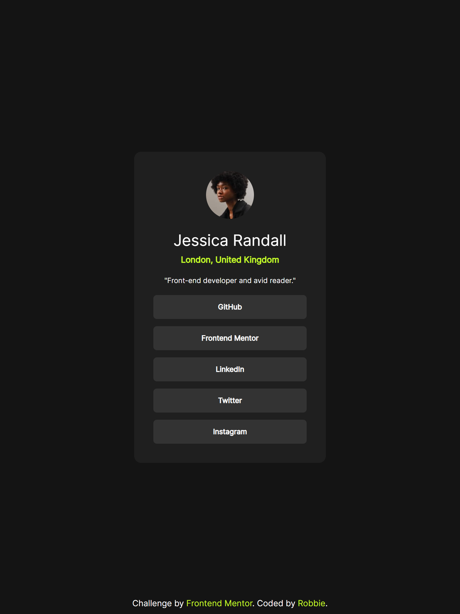

# Frontend Mentor - Social links profile solution

This is a solution to the [Social links profile challenge on Frontend Mentor](https://www.frontendmentor.io/challenges/social-links-profile-UG32l9m6dQ). Frontend Mentor challenges help you improve your coding skills by building realistic projects. 

## Table of contents

- [Overview](#overview)
  - [The challenge](#the-challenge)
  - [Screenshot](#screenshot)
  - [Links](#links)
- [My process](#my-process)
  - [Built with](#built-with)
  - [What I learned](#what-i-learned)
  - [Useful resources](#useful-resources)
- [Author](#author)
- [Acknowledgments](#acknowledgments)

## Overview

### The challenge

Users should be able to:

- See hover and focus states for all interactive elements on the page

### Screenshot



### Links

- Solution URL: [https://github.com/robbiedob21/social-links-profile-main](https://github.com/robbiedob21/social-links-profile-main)
- Live Site URL: [https://robbiedob21-social-links.netlify.app/](https://robbiedob21-social-links.netlify.app/)

## My process

### Built with

- Semantic HTML5 markup
- Tailwind CSS

### What I learned

I used an arbitrary value for the header text size which is something I have not explored before and it seems easy enough to use in future if I require it.

```html
<h1 class="text-[1.625rem]">Jessica Randall</h1>
```

### Useful resources

- [10 Tailwind Classes I Wish I Knew Earlier](https://www.youtube.com/watch?v=x1RJ5Q09PqM) - I learnt about the tailwind size utility class and was able to implement it in this project

## Author

- Website - [Robbie.kiwi](https://robbie.kiwi/)
- Frontend Mentor - [@robbiedob21](https://www.frontendmentor.io/profile/robbiedob21)

## Acknowledgments

Thanks again Front End Mentor
